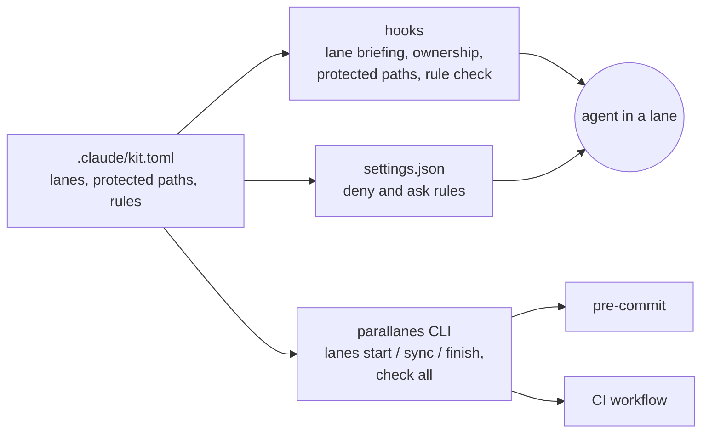

# parallanes

**Run several Claude Code agents on one repository at once, without them stepping on each
other.** Each agent works in its own *lane*: a git worktree that owns certain paths. An edit
outside those paths stops and asks, and work lands only after the tests pass on it combined with
the latest `main`.

Claude Code already gives each session its own worktree. parallanes adds the layer on top: who
owns what, a task cycle that keeps lanes current, and the same checks in the agent's session, in
pre-commit and in CI, so no single place can be skipped.

## Why it exists

I built a Unity game with three Claude Code agents working in parallel, one per git worktree. The
worktrees kept their files apart, but nothing kept their *work* apart. Agents edited each
other's areas, branches drifted from `main`, and "tests pass" meant they passed on a branch that
wasn't the one that merged. I fixed that by hand with instruction files, hooks and a review
step ([survey of that setup](docs/survey-hoem.md)). parallanes is that setup made general,
tested on Windows and Linux, and installable into any project.

## What Claude Code does, and what parallanes adds

| Claude Code does by itself | parallanes adds |
| --- | --- |
| A worktree per session: `claude --worktree`, desktop worktree sessions, subagents with `isolation: worktree`; a named worktree is reused ([docs](https://code.claude.com/docs/en/worktrees.md#start-claude-in-a-worktree)) | **Lanes that own paths**, set in `.claude/kit.toml`. Claude Code has no idea of one worktree owning files ([docs](https://code.claude.com/docs/en/worktrees.md)) |
| `.worktreeinclude` copies gitignored files into a new worktree ([docs](https://code.claude.com/docs/en/worktrees.md#copy-gitignored-files-into-worktrees)) | An **ownership hook** that stops to ask before an edit outside the lane, and a **lane check** in pre-commit and CI that refuses a cross-lane change from anyone |
| Hooks and permission rules you write yourself ([docs](https://code.claude.com/docs/en/hooks-guide.md)) | Those hooks and rules, written and tested for you from one config file: protected paths, secrets, code patterns you forbid, a session-start briefing that tells each agent its lane |
| — | **A task cycle**: `lanes start` branches from the latest `main`; `lanes finish` brings in the other lanes' work, runs the whole suite on that exact result, then opens a PR (or, in local mode, fast-forwards `main`) |
| `/code-review` and Code Review on GitHub find bugs, and don't block a merge ([docs](https://code.claude.com/docs/en/code-review.md#how-reviews-work)) | A read-only **reviewer** that checks the change against your plan and rules, and skills for the loop: `/plan-feature` → `/implement` → `/wrap-up` |

[lanekeeper](https://github.com/kish21/parallel-agents) solves the same problem for any coding
agent by gating the merge. parallanes is for Claude Code: it flags the edit as it happens and
runs the whole task loop. It borrows several of lanekeeper's ideas ([notes](docs/survey-lanekeeper.md)).

## Does it work? A two-lane trial

Two agents built a small web app at the same time: an `api` lane owning `server/**` and a `web`
lane owning `public/**`, three tasks each ([write-up](docs/trial/two-lane-trial.md); the trial's
repository, with its plans, review reports and every lane merge:
[parallanes-trial](https://github.com/scotteskridge/parallanes-trial)).

- All six tasks landed on `main` in a straight line. Every finish ran the full suite on the
  exact commit that landed, 77 tests by the end.
- Three times the other lane had landed first; `lanes finish` rebased onto its work before
  testing. That surfaced the one real conflict (both lanes adding to the decisions log) in the
  lane's own folder, where the agent fixed it before `main` moved.
- When a task needed a file no lane owns (`.gitignore`), the agent asked first, the ownership
  hook stopped the edit, and pre-commit refused the commit. Plain worktrees have neither the
  hook nor the pre-commit check.
- In four of the six tasks the reviewer found a real bug, fixed before landing.
- It also found friction, now on the backlog: lanes inside the project silently used the main
  checkout's `node_modules` (now flagged when a lane is created and in its briefing), and an out-of-lane edit the owner *wants* has no
  smooth way through yet.

## Quickstart

You need git, Python 3.11+ and [Claude Code](https://code.claude.com); `gh` is optional (for
pull requests). Your project is a git repository with at least one commit on `main`. For a brand
new one, run `git init -b main` and commit a first file.

1. **Install** from the folder that holds your project. Nothing of yours is overwritten, and
   `--dry-run` shows what it would write. The installer asks five questions with detected
   answers (`--yes` takes them all) and ends with a short list of what's left, such as setting
   `test_command`, which `lanes finish` runs.

   ```bash
   git clone https://github.com/scotteskridge/parallanes
   sh parallanes/install.sh --target my-project
   cd my-project
   ```

   On Windows PowerShell, the install line is
   `powershell -ExecutionPolicy Bypass -File parallanes\install.ps1 --target my-project`.

2. **Describe your lanes** at the end of `.claude/kit.toml`:

   ```toml
   [[lanes]]
   name = "api"
   scope = "HTTP layer"
   owns = ["server/**"]

   [[lanes]]
   name = "web"
   scope = "Front end"
   owns = ["public/**"]
   ```

3. **Commit, then create the lanes.** Each lane is a checkout of `main`, so it only has what's
   committed there (pushed too, once the project has a GitHub remote):

   ```bash
   git add -A
   git commit -m "Add parallanes"
   sh .claude/kit/parallanes lanes create
   ```

4. **One agent per lane.** Open Claude Code in `.claude/worktrees/api/`, and in a second terminal
   in `.claude/worktrees/web/`. Open each by its folder: `claude --worktree` would take the lane
   over and delete its folder on exit. In the api lane, run
   `sh .claude/kit/parallanes lanes start add-book` and work as usual; the web lane does the same
   with its own task. `/wrap-up` reviews a change, and `lanes finish` lands it. The full guide
   is installed as `docs/ai/parallel-lanes.md`.

## How it fits together



| Guardrail | Where it runs | What it stops |
| --- | --- | --- |
| Lane briefing | Session start | An agent not knowing its lane, paths, ports, or that its branch is behind |
| Ownership | Every edit, then pre-commit and CI | Changes outside the lane's paths (asks in the session, refuses at commit) |
| Protected paths | Deny rules, a command backstop, pre-commit and CI | Edits to the kit's config, workflows and secrets; force pushes and switching checks off |
| Rule check | After every edit, pre-commit and CI | Code patterns you forbid in `kit.toml`, each with a glob and a message |
| Task cycle | `lanes start` / `finish` | Stale branches and merges tested on something other than what lands |
| Reviewer | `/wrap-up` | Changes that miss the plan, the rules or the tests |

What the checks can't stop, and why, is written down in each project's
`docs/ai/protected-paths.md`.

## How this was built

The kit was built the way it asks you to work: numbered plans, one pull request each, every one
reviewed by a fresh agent before merging, with the reasons in a decisions log.

- [Plans](docs/plans/README.md) and the [design](docs/ARCHITECTURE.md)
- [Decisions log](docs/decisions-log.md), [roadmap](docs/ROADMAP.md), [changelog](CHANGELOG.md)
- About 1,400 tests, run in CI on Windows and Ubuntu

**Next (v0.2):** a Claude Code plugin for one-line installs and updates, `/onboard`, per-lane
ports, a Unity pack, and evals.

## License

[MIT](LICENSE)
